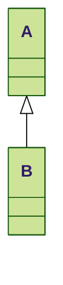

readme
======

 * [FeatureA](FeatureA.md)
 * [FeatureB](FeatureB.md)

| First Item | Second Item | Third Item|
| -----------|-------------|------------|
| Sword  | Wand | Bow|
| short | none | long|

- [ ] item1
- [x] item2

